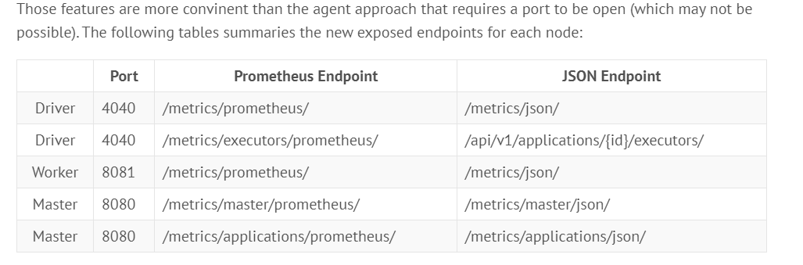

# Prometheus-ORKUZ-2022L

helm upgrade -i prom ./kube-prometheus-stack -f ./values/prometheus-values.yml -n prom --create-namespace

helm upgrade -i spark ./spark-operator -f ./values/spark-values.yml -n spark --create-namespace

kubectl apply -f ./pi.yml

aplikacja sparkowa readstream blob 1 --> czeka na plik w formacie X --> dostaje plik to przelicza wordcount --> zapisuje writestream blob 2

https://dzlab.github.io/bigdata/2020/07/03/spark3-monitoring-1/

Monitoring in 3.0
Apache Spark 3.0 introduced the following resources to expose metrics:

PrometheusServlet SPARK-29032 which makes the Master/Worker/Driver nodes expose metrics in a Prometheus format (in addition to JSON) at the existing ports, i.e. 8080/8081/4040.
PrometheusResource SPARK-29064/SPARK-29400 which export metrics of all executors at the driver. Enabled by spark.ui.prometheus.enabled (default: false)

--master spark://localhost:7077 \
--conf spark.ui.prometheus.enabled=true

*.sink.prometheusServlet.class=org.apache.spark.metrics.sink.PrometheusServlet
*.sink.prometheusServlet.path=/metrics/prometheus

./spark-submit
--master k8s://https://orkuz-2022l-08ed299e.hcp.eastasia.azmk8s.io:443
--deploy-mode cluster
--name spark-demo
--conf spark.executor.instances=1
--conf spark.kubernetes.authenticate.driver.serviceAccountName=spark
--conf spark.ui.prometheus.enabled=true
--conf spark.kubernetes.container.image=damianfilonowicz/spark:azure
local:///opt/application/streaming.py

